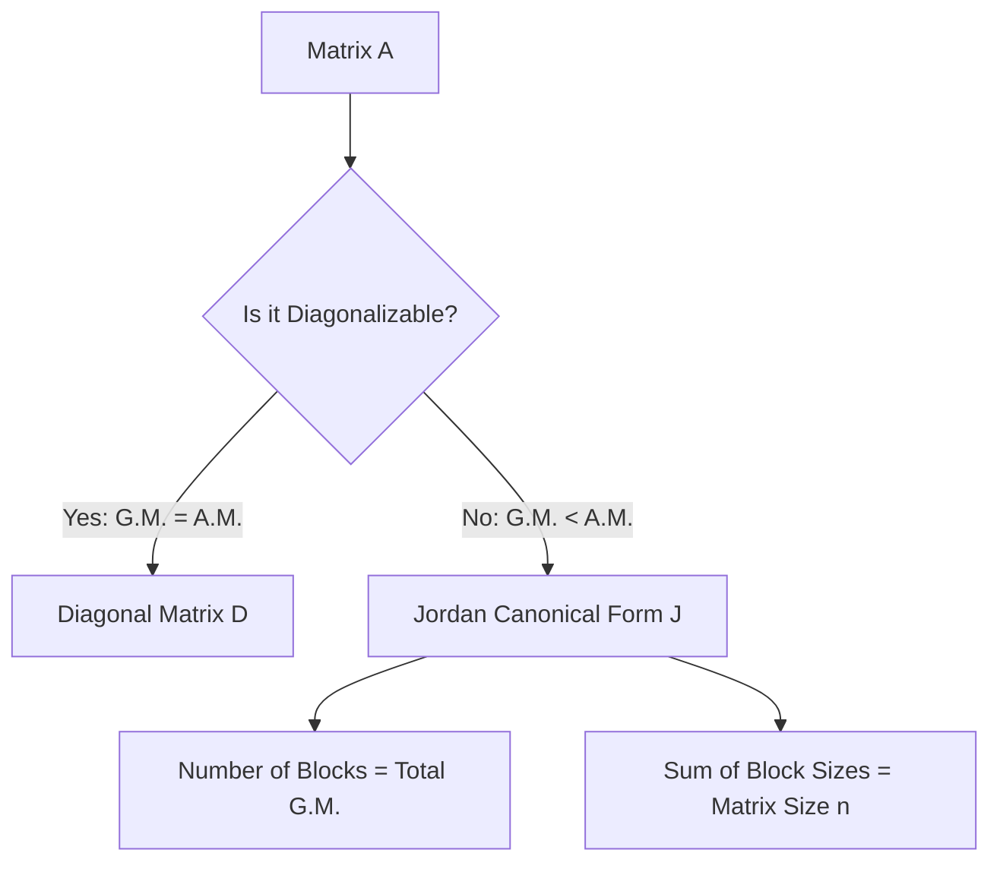

# Linear Algebra Notes: Minimal Polynomial

## 📌 Concept Overview

### Definition of Minimal Polynomial
For a square matrix $A \in \mathbb{R}^{n \times n}$, the **minimal polynomial** $m_A(\lambda)$ is the unique **monic polynomial** (a polynomial whose leading coefficient is 1) of the **lowest possible degree** that annihilates the matrix $A$. That is:

$$m_A(A) = \mathbf{0}$$

### Key Properties & Relationships
* **Divisibility:** If any polynomial $f(\lambda)$ satisfies $f(A) = \mathbf{0}$, then the minimal polynomial $m_A(\lambda)$ must divide $f(\lambda)$ perfectly without a remainder. 
  $$f(A) = \mathbf{0} \iff f(\lambda) = m_A(\lambda) \cdot q(\lambda)$$
* **Cayley-Hamilton Theorem Connection:** Since the characteristic polynomial $c_A(\lambda) = \det(\lambda I - A)$ always satisfies $c_A(A) = \mathbf{0}$, the minimal polynomial $m_A(\lambda)$ is always a **divisor** of the characteristic polynomial.
* **Shared Roots:** Both $c_A(\lambda)$ and $m_A(\lambda)$ share the exact same set of distinct roots (the eigenvalues of matrix $A$), though their algebraic multiplicities (powers) may differ.

---

## 📈 Conceptual Differences: Diagonal vs. Jordan Blocks

The minimal polynomial captures the size of the largest Jordan block for each eigenvalue, indicating how far a matrix deviates from being perfectly diagonalizable.

```text
  Characteristic Polynomial c_A(λ) = (λ - c)^n
  
  [ Pure Diagonal Matrix ]            [ Jordan Block (Defective) ]
   (Every block is 1x1)                (Single block of size n)
         │                                    │
         ▼                                    ▼
  Minimal Polynomial                  Minimal Polynomial
  m_A(λ) = (λ - c)^1                  m_A(λ) = (λ - c)^n

```

---

## 📝 Detailed Walkthrough: Image Examples

### 🔍 Explaining the Monic Side-Note from the Image

On the right side of the handwritten notes, there is a snippet:


$$2\lambda^3 - \lambda^2 + 4\lambda - 8 \implies \lambda^3 - \frac{1}{2}\lambda^2 + 2\lambda - 4$$


**Meaning:** A minimal polynomial must be **monic**. If your initial characteristic calculations produce a leading coefficient other than $1$ (like $2$), you must divide the entire polynomial by that coefficient to scale the highest-degree term to $1$.

---

### Example 1: Diagonal Matrix

**Problem:** Find the characteristic and minimal polynomial for:


$$A = \begin{bmatrix} 2 & 0 \\ 0 & 2 \end{bmatrix}$$

#### Step 1: Find the Characteristic Polynomial $c_A(\lambda)$

$$c_A(\lambda) = \det(\lambda I - A) = \det\begin{bmatrix} \lambda - 2 & 0 \\ 0 & \lambda - 2 \end{bmatrix} = (\lambda - 2)^2$$

#### Step 2: Test Potential Minimal Polynomial Factors

The roots of $m_A(\lambda)$ must be the same as $c_A(\lambda)$, but with a lower or equal degree. The possibilities are:

1. $f_1(\lambda) = (\lambda - 2)$
2. $f_2(\lambda) = (\lambda - 2)^2$

Let's test the lowest-degree candidate, $f_1(\lambda) = \lambda - 2$, by substituting $A$:


$$f_1(A) = A - 2I = \begin{bmatrix} 2 & 0 \\ 0 & 2 \end{bmatrix} - \begin{bmatrix} 2 & 0 \\ 0 & 2 \end{bmatrix} = \begin{bmatrix} 0 & 0 \\ 0 & 0 \end{bmatrix} = O_{2 \times 2}$$

Since $f_1(A) = \mathbf{0}$, it satisfies the definition of the minimal polynomial.

* **Result:** $m_A(\lambda) = \lambda - 2$

---

### Example 2: Upper Triangular (Defective) Matrix

**Problem:** Find the characteristic and minimal polynomial for:


$$A_2 = \begin{bmatrix} 2 & 1 \\ 0 & 2 \end{bmatrix}$$

#### Step 1: Find the Characteristic Polynomial $c_{A_2}(\lambda)$

$$c_{A_2}(\lambda) = \det(\lambda I - A_2) = \det\begin{bmatrix} \lambda - 2 & -1 \\ 0 & \lambda - 2 \end{bmatrix} = (\lambda - 2)^2$$

#### Step 2: Test Potential Minimal Polynomial Factors

Test the lowest-degree linear factor candidate, $f_1(\lambda) = \lambda - 2$:


$$f_1(A_2) = A_2 - 2I = \begin{bmatrix} 2 & 1 \\ 0 & 2 \end{bmatrix} - \begin{bmatrix} 2 & 0 \\ 0 & 2 \end{bmatrix} = \begin{bmatrix} 0 & 1 \\ 0 & 0 \end{bmatrix} \neq O_{2 \times 2}$$

Because $f_1(A_2) \neq \mathbf{0}$, the minimal polynomial must be of a higher degree. We step up to the next factor choice:


$$f_2(A_2) = (A_2 - 2I)^2 = \begin{bmatrix} 0 & 1 \\ 0 & 0 \end{bmatrix} \begin{bmatrix} 0 & 1 \\ 0 & 0 \end{bmatrix} = \begin{bmatrix} 0 & 0 \\ 0 & 0 \end{bmatrix} = O_{2 \times 2}$$

* **Result:** $m_{A_2}(\lambda) = (\lambda - 2)^2$

---

## 🏋️ Additional Practice Problems

### Problem 3

Find the minimal polynomial of the following matrix:


$$A = \begin{bmatrix} 5 & 0 & 0 \\ 0 & 5 & 0 \\ 0 & 0 & 3 \end{bmatrix}$$

#### Step-by-Step Solution:

1. **Find $c_A(\lambda)$:** Since it is a diagonal matrix, the characteristic polynomial is found directly from the diagonal entries:

$$c_A(\lambda) = (\lambda - 5)^2(\lambda - 3)$$


2. **Formulate the minimal polynomial candidate:**
The minimal polynomial must contain each unique root at least once. The lowest-degree candidate is:

$$f(\lambda) = (\lambda - 5)(\lambda - 3)$$


3. **Test the candidate matrix:**

$$(A - 5I)(A - 3I) = \begin{bmatrix} 0 & 0 & 0 \\ 0 & 0 & 0 \\ 0 & 0 & -2 \end{bmatrix} \begin{bmatrix} 2 & 0 & 0 \\ 0 & 2 & 0 \\ 0 & 0 & 0 \end{bmatrix} = \begin{bmatrix} 0 & 0 & 0 \\ 0 & 0 & 0 \\ 0 & 0 & 0 \end{bmatrix} = \mathbf{0}$$


4. **Conclusion:** 
$$m_A(\lambda) = (\lambda - 5)(\lambda - 3) = \lambda^2 - 8\lambda + 15$$


---

### Problem 4

Find the minimal polynomial of the following matrix:


$$A = \begin{bmatrix} 3 & 1 & 0 \\ 0 & 3 & 1 \\ 0 & 0 & 3 \end{bmatrix}$$

#### Step-by-Step Solution:

1. **Find $c_A(\lambda)$:**

$$c_A(\lambda) = (\lambda - 3)^3$$


2. **Test candidates sequentially by degree:**
* Try $(\lambda - 3)^1$:

$$A - 3I = \begin{bmatrix} 0 & 1 & 0 \\ 0 & 0 & 1 \\ 0 & 0 & 0 \end{bmatrix} \neq \mathbf{0}$$


* Try $(\lambda - 3)^2$:

$$(A - 3I)^2 = \begin{bmatrix} 0 & 0 & 1 \\ 0 & 0 & 0 \\ 0 & 0 & 0 \end{bmatrix} \neq \mathbf{0}$$


* Try $(\lambda - 3)^3$:

$$(A - 3I)^3 = \begin{bmatrix} 0 & 0 & 0 \\ 0 & 0 & 0 \\ 0 & 0 & 0 \end{bmatrix} = \mathbf{0}$$


3. **Conclusion:** 
$$m_A(\lambda) = (\lambda - 3)^3$$


# Linear Algebra Notes: Polynomials of Direct Sums & Intro to Jordan Canonical Form

## 📌 Concept 1: Direct Sum of Matrices & Polynomial Properties

### What is a Direct Sum?
If $A$ and $B$ are square matrices of sizes $r \times r$ and $s \times s$ respectively, their **direct sum** $A \oplus B$ forms a new square block-diagonal matrix $C$ of size $(r+s) \times (r+s)$:

$$C = A \oplus B = \begin{bmatrix} A & \mathbf{0} \\ \mathbf{0} & B \end{bmatrix}$$

### Crucial Polynomial Results for Block Matrices
When a matrix is structured as a direct sum $C = A \oplus B$, its polynomials scale predictably:

1. **Characteristic Polynomial ($c_C(\lambda)$):** The product of the individual characteristic polynomials.
   $$c_C(\lambda) = c_A(\lambda) \cdot c_B(\lambda)$$
2. **Minimal Polynomial ($m_C(\lambda)$):** The **Least Common Multiple (LCM)** of the individual minimal polynomials.
   $$m_C(\lambda) = \text{LCM}\big(m_A(\lambda), m_B(\lambda)\big)$$

---

## 📈 Visual Layout of a Direct Sum Matrix

```text
       ┌───────────────┐
       │   Matrix A    │       0
       │  (Block 1)    │
       ├───────────────┼───────────────┐
       │               │   Matrix B    │
       │       0       │  (Block 2)    │
       │               │               │
       └───────────────┴───────────────┘

```

---

## 📝 Detailed Walkthrough: Example 1 (From Image)

Given the two square matrices:


$$A = \begin{bmatrix} 2 & 0 \\ 0 & 2 \end{bmatrix} \quad \text{and} \quad B = \begin{bmatrix} 2 & 1 \\ 0 & 2 \end{bmatrix}$$

Construct the direct sum matrix $C = A \oplus B$:


$$C = \begin{bmatrix} 2 & 0 & \bigm| & 0 & 0 \\ 0 & 2 & \bigm| & 0 & 0 \\ --- & --- & \bigm| & --- & --- \\ 0 & 0 & \bigm| & 2 & 1 \\ 0 & 0 & \bigm| & 0 & 2 \end{bmatrix}_{4 \times 4}$$

### Step 1: Compute Individual Polynomials

From our previous knowledge of these exact matrices:

* For diagonal matrix $A$:

$$c_A(\lambda) = (\lambda - 2)^2 \quad \text{and} \quad m_A(\lambda) = (\lambda - 2)$$


* For Jordan block matrix $B$:

$$c_B(\lambda) = (\lambda - 2)^2 \quad \text{and} \quad m_B(\lambda) = (\lambda - 2)^2$$


### Step 2: Compute Total Characteristic Polynomial $c_C(\lambda)$

Using the product rule:


$$c_C(\lambda) = c_A(\lambda) \cdot c_B(\lambda) = (\lambda - 2)^2 \cdot (\lambda - 2)^2 = (\lambda - 2)^4$$

### Step 3: Compute Total Minimal Polynomial $m_C(\lambda)$

Using the LCM rule:


$$m_C(\lambda) = \text{LCM}\big(m_A(\lambda), m_B(\lambda)\big) = \text{LCM}\big((\lambda - 2)^1, (\lambda - 2)^2\big)$$

The highest power of the base $(\lambda - 2)$ among the components is $2$.

* **Result:** $m_C(\lambda) = (\lambda - 2)^2$

---

## 🏋️ Direct Sum Practice Problem

**Problem:** Let $A = \begin{bmatrix} 3 & 0 \\ 0 & 3 \end{bmatrix}$ and $B = \begin{bmatrix} 5 & 0 \\ 0 & 5 \end{bmatrix}$. Find $c_C(\lambda)$ and $m_C(\lambda)$ for $C = A \oplus B$.

### Step-by-Step Solution:

1. **Find individual polynomials:**
* $c_A(\lambda) = (\lambda - 3)^2$, $m_A(\lambda) = (\lambda - 3)$
* $c_B(\lambda) = (\lambda - 5)^2$, $m_B(\lambda) = (\lambda - 5)$


2. **Calculate $c_C(\lambda)$:**

$$c_C(\lambda) = (\lambda - 3)^2(\lambda - 5)^2$$


3. **Calculate $m_C(\lambda)$:**

$$m_C(\lambda) = \text{LCM}\big((\lambda - 3), (\lambda - 5)\big) = (\lambda - 3)(\lambda - 5)$$


---

## 📌 Concept 2: Introduction to Jordan Canonical Form (JCF)

### Diagonalizability vs. JCF

A fundamental theorem in linear algebra states:

> A square matrix of order $n \times n$ is **diagonalizable** if and only if it possesses $n$ linearly independent eigenvectors.

However, many matrices lack enough independent eigenvectors due to repeating eigenvalues with insufficient geometric multiplicity. These are called **defective matrices**.

### What is Jordan Canonical Form?

When a matrix cannot be completely diagonalized, the **Jordan Canonical Form (JCF)** serves as the closest possible alternative. It is a block-diagonal matrix structure comprised of **Jordan blocks** along the main diagonal:

$$J = \begin{bmatrix} J_1(\lambda_1) & & 0 \\ & J_2(\lambda_2) & \\ 0 & & \ddots \end{bmatrix}$$

Where each individual Jordan block $J_i(\lambda)$ looks like this:


$$J_i(\lambda) = \begin{bmatrix} \lambda & 1 & 0 & \dots & 0 \\ 0 & \lambda & 1 & \dots & 0 \\ \vdots & \vdots & \ddots & \ddots & \vdots \\ 0 & 0 & 0 & \lambda & 1 \\ 0 & 0 & 0 & 0 & \lambda \end{bmatrix}$$

### Key JCF Insights

* Every square matrix is similar to a Jordan Canonical Form matrix via a similarity transformation ($A = P J P^{-1}$).
* The number of Jordan blocks corresponding to an eigenvalue equals its **geometric multiplicity** (number of independent eigenvectors).
* The size of the largest Jordan block for an eigenvalue matches its exponent in the **minimal polynomial**.


# Linear Algebra Notes: Matrix Diagonalization vs. Jordan Canonical Form

## 📌 Concept Overview: Diagonalizability & Geometric Multiplicity

Matrix diagonalization breaks down a linear transformation into scaling operations along independent axes. However, this is only possible if the matrix has enough independent directions (eigenvectors).

### 🔑 Key Definitions
* **Algebraic Multiplicity (A.M.):** The number of times an eigenvalue $\lambda$ appears as a root of the characteristic polynomial.
* **Geometric Multiplicity (G.M.):** The number of linearly independent eigenvectors associated with an eigenvalue $\lambda$. It corresponds to the dimension of the null space $\text{null}(A - \lambda I)$.
* **The Golden Rule:** For any eigenvalue:
  $$\text{A.M.} \geq \text{G.M.}$$
* **Diagonalizability Condition:** An $n \times n$ matrix is **diagonalizable** ($A = PDP^{-1}$) if and only if the sum of the geometric multiplicities of all eigenvalues equals $n$ (i.e., $\text{A.M.} = \text{G.M.}$ for every eigenvalue).
* **Defective Matrix:** If $\text{A.M.} > \text{G.M.}$ for any eigenvalue, the matrix is short on eigenvectors and cannot be diagonalized. Instead, it must be reduced to its **Jordan Canonical Form** ($A = SJS^{-1}$).

---

## 📊 Structural Comparison of Transformations

```text
    [ Diagonalizable Matrix ]               [ Defective Matrix ]
     (A.M. == G.M. for all λ)              (A.M. > G.M. for some λ)
                │                                     │
                ▼                                     ▼
        A = P * D * P⁻¹                       A = S * J * S⁻¹
  Where D is purely diagonal.            Where J contains Jordan blocks
                                         with 1s on the superdiagonal.

```

---

## 📝 Detailed Walkthrough: Example 1 (Diagonalizable Matrix)

**Problem:** Analyze and decompose the matrix:


$$A_1 = \begin{bmatrix} 7 & 2 \\ -4 & 1 \end{bmatrix}$$

### Step 1: Find Eigenvalues ($\lambda$)

Find the roots of the characteristic equation $\det(A_1 - \lambda I) = 0$:


$$\det \begin{bmatrix} 7 - \lambda & 2 \\ -4 & 1 - \lambda \end{bmatrix} = 0$$

$$(7 - \lambda)(1 - \lambda) - (2)(-4) = 0$$

$$\lambda^2 - 8\lambda + 7 + 8 = 0 \implies \lambda^2 - 8\lambda + 15 = 0$$

$$(\lambda - 5)(\lambda - 3) = 0 \implies \lambda_1 = 5, \quad \lambda_2 = 3$$

> Here, both eigenvalues have $\text{A.M.} = 1$. Since $1 \geq \text{G.M.} \geq 1$, their $\text{G.M.}$ must also be $1$. Because $\text{A.M.} = \text{G.M.}$ for all eigenvalues, $A_1$ is **fully diagonalizable**.

### Step 2: Calculate Eigenvectors ($X_1, X_2$)

#### For $\lambda_1 = 5$:

Solve $(A_1 - 5I)X_1 = 0$:


$$\begin{bmatrix} 7 - 5 & 2 \\ -4 & 1 - 5 \end{bmatrix} \begin{bmatrix} x_1 \\ x_2 \end{bmatrix} = \begin{bmatrix} 2 & 2 \\ -4 & -4 \end{bmatrix} \begin{bmatrix} x_1 \\ x_2 \end{bmatrix} = \begin{bmatrix} 0 \\ 0 \end{bmatrix}$$


From the row $2x_1 + 2x_2 = 0 \implies x_1 = -x_2$. Let $x_2 = -1 \implies X_1 = \begin{bmatrix} 1 \\ -1 \end{bmatrix} = (1, -1)^T$.

#### For $\lambda_2 = 3$:

Solve $(A_1 - 3I)X_2 = 0$:


$$\begin{bmatrix} 7 - 3 & 2 \\ -4 & 1 - 3 \end{bmatrix} \begin{bmatrix} x_1 \\ x_2 \end{bmatrix} = \begin{bmatrix} 4 & 2 \\ -4 & -2 \end{bmatrix} \begin{bmatrix} x_1 \\ x_2 \end{bmatrix} = \begin{bmatrix} 0 \\ 0 \end{bmatrix}$$


From the row $4x_1 + 2x_2 = 0 \implies 2x_1 = -x_2$. Let $x_1 = 1 \implies x_2 = -2 \implies X_2 = \begin{bmatrix} 1 \\ -2 \end{bmatrix} = (1, -2)^T$.

### Step 3: Construct $P$ and $D$

* $P$ is formed by placing the eigenvectors as columns: $P = \begin{bmatrix} X_1 & X_2 \end{bmatrix} = \begin{bmatrix} 1 & 1 \\ -1 & -2 \end{bmatrix}$
* $D$ is the diagonal matrix matching the eigenvalues in order: $D = \begin{bmatrix} 5 & 0 \\ 0 & 3 \end{bmatrix}$

**Final Decomposition:**


$$A_1 = P D P^{-1} = \begin{bmatrix} 1 & 1 \\ -1 & -2 \end{bmatrix} \begin{bmatrix} 5 & 0 \\ 0 & 3 \end{bmatrix} \begin{bmatrix} 1 & 1 \\ -1 & -2 \end{bmatrix}^{-1}$$

---

## 📝 Detailed Walkthrough: Example 2 (Defective Matrix)

**Problem:** Analyze and decompose the matrix:


$$A_2 = \begin{bmatrix} 1 & 1 \\ 0 & 1 \end{bmatrix}$$

### Step 1: Find Eigenvalues ($\lambda$)

Since $A_2$ is an upper triangular matrix, its eigenvalues are the diagonal elements:


$$\lambda = 1, 1$$

* **Algebraic Multiplicity (A.M.) of $\lambda = 1$ is 2.**

### Step 2: Determine Geometric Multiplicity (G.M.)

Find the number of independent eigenvectors by solving $(A_2 - 1I)X = 0$:


$$\begin{bmatrix} 1 - 1 & 1 \\ 0 & 1 - 1 \end{bmatrix} \begin{bmatrix} x_1 \\ x_2 \end{bmatrix} = \begin{bmatrix} 0 & 1 \\ 0 & 0 \end{bmatrix} \begin{bmatrix} x_1 \\ x_2 \end{bmatrix} = \begin{bmatrix} 0 \\ 0 \end{bmatrix}$$


This reveals the system matrix equation:


$$0x_1 + 1x_2 = 0 \implies x_2 = 0$$


The variable $x_1$ can be anything (arbitrary). Setting $x_1 = 1$ gives us our single independent eigenvector:


$$X = \begin{bmatrix} 1 \\ 0 \end{bmatrix} = (1, 0)^T$$

* **Geometric Multiplicity (G.M.) of $\lambda = 1$ is 1.**

### Step 3: Check Diagonalizability & Setup JCF

$$\text{A.M. (2)} > \text{G.M. (1)}$$


Because we only have one linearly independent eigenvector for a $2 \times 2$ space, **$A_2$ cannot be diagonalized** ($\mathbf{A_2 \neq PDP^{-1}}$).

Instead, it must be written in Jordan Canonical Form ($A_2 = SJS^{-1}$), where $J$ is a Jordan block of size $2 \times 2$:


$$J = \begin{bmatrix} 1 & 1 \\ 0 & 1 \end{bmatrix}$$

---

## 🏋️ Additional Practice Problems

### Problem 3: Multiplicity Verification

**Problem:** Determine if the following matrix is diagonalizable:


$$A = \begin{bmatrix} 4 & 0 & 0 \\ 1 & 4 & 0 \\ 0 & 0 & 5 \end{bmatrix}$$

#### Step-by-Step Solution:

1. **Identify Eigenvalues:** The matrix is lower triangular, so the eigenvalues are on the diagonal: $\lambda = 4, 4, 5$.
* For $\lambda = 5$: $\text{A.M.} = 1 \implies \text{G.M.} = 1$
* For $\lambda = 4$: $\text{A.M.} = 2$


2. **Calculate G.M. for $\lambda = 4$:** Solve $(A - 4I)X = 0$:

$$\begin{bmatrix} 0 & 0 & 0 \\ 1 & 0 & 0 \\ 0 & 0 & 1 \end{bmatrix} \begin{bmatrix} x_1 \\ x_2 \end{bmatrix} = \begin{bmatrix} 0 \\ 0 \\ 0 \end{bmatrix} \implies x_1 = 0, \quad x_3 = 0$$


Here, $x_2$ is free. This gives only one unique eigenvector: $\begin{bmatrix} 0 & 1 & 0 \end{bmatrix}^T$.
* Thus, $\text{G.M.} = 1$ for $\lambda = 4$.


3. **Conclusion:** Since $\text{A.M. (2)} > \text{G.M. (1)}$ for $\lambda = 4$, the matrix is **defective** and **not diagonalizable**.

# Linear Algebra Notes: Jordan Blocks and Generalized Eigenvectors

## 📌 Concept Overview: The Jordan Block

When a square matrix $A$ is **defective** (meaning its Algebraic Multiplicity ($\text{A.M.}$) is strictly greater than its Geometric Multiplicity ($\text{G.M.}$)), it cannot be completely diagonalized into a $PDP^{-1}$ structure. Instead, it is reduced to its **Jordan Canonical Form** ($SJS^{-1}$). 

The building blocks of this form are called **Jordan Blocks**.

### 🔑 Definition of a Jordan Block $J_k(\lambda_0)$
A Jordan block $J_k(\lambda_0)$ is a square matrix of size $k \times k$ characterized by:
1. The target eigenvalue $\lambda_0$ along the entire **main diagonal**.
2. The value $1$ along the **superdiagonal** (the diagonal directly above the main diagonal).
3. The value $0$ everywhere else.

#### Dimensions at a Glance:
* $J_1(\lambda_0) = [\lambda_0]_{1 \times 1}$
* $J_2(\lambda_0) = \begin{bmatrix} \lambda_0 & 1 \\ 0 & \lambda_0 \end{bmatrix}_{2 \times 2}$
* $J_3(\lambda_0) = \begin{bmatrix} \lambda_0 & 1 & 0 \\ 0 & \lambda_0 & 1 \\ 0 & 0 & \lambda_0 \end{bmatrix}_{3 \times 3}$

---

## ⚡ Core Properties of a Jordan Block

### 1. Single Eigenvalue with $\text{A.M.} = k$
A Jordan block contains only one unique eigenvalue ($\lambda_0$). Its characteristic polynomial is:
$$c_J(\lambda) = \det(J_k(\lambda_0) - \lambda I_k) = (\lambda - \lambda_0)^k$$

### 2. Geometric Multiplicity is Always 1 ($\text{G.M.} = 1$)
No matter how massive a single Jordan block $J_k(\lambda_0)$ is, it yields exactly **one** linearly independent eigenvector. This matches the definition of a defective matrix space where $\text{A.M.} \geq \text{G.M.}$.

### 3. Action on the Standard Basis (Generalized Eigenvectors)
Let $\{e_1, e_2, \dots, e_k\}$ denote the standard basis vectors for a $k$-dimensional space. Multiplying a Jordan block by these standard basis elements reveals how it links normal eigenvectors to **generalized eigenvectors**:

* For the first column vector ($e_1$):
  $$J_k(\lambda_0)e_1 = \lambda_0 e_1$$
  *(This means $e_1$ is a standard, classical eigenvector)*

* For subsequent column vectors ($e_i$ where $i > 1$):
  $$J_k(\lambda_0)e_i = \lambda_0 e_i + e_{i-1}$$
  *(This means $e_i$ acts as a generalized eigenvector, shifting down a chain)*

---

## 📈 Visualizing Vector Mappings in a Jordan Chain

Instead of scaling along independent coordinates like a diagonal matrix, a Jordan block maps standard unit vectors along a chain structure:

```text
    [ Basis Vector e₂ ] ───( Multiply by J )───► [ λ₀·e₂ + e₁ ] 
                                                        │
                                          ( Extracts the shift element e₁ )
                                                        ▼
    [ Basis Vector e₁ ] ───( Multiply by J )───► [    λ₀·e₁   ]  (Pure Scaling)

```

---

## 📝 Step-by-Step Walkthrough (From Image Verification)

**Problem:** Analyze the behavior of a $2 \times 2$ Jordan block matrix with $\lambda_0 = 2$ acting on the standard basis vectors:


$$J = \begin{bmatrix} 2 & 1 \\ 0 & 2 \end{bmatrix}$$

### Step 1: Find its Characteristic Polynomial

$$c_J(\lambda) = \det\begin{bmatrix} 2-\lambda & 1 \\ 0 & 2-\lambda \end{bmatrix} = (\lambda - 2)^2$$

* Here, $\text{A.M.} = 2$.

### Step 2: Multiplication with Standard Basis $e_1 = \begin{bmatrix} 1 \\ 0 \end{bmatrix}$

$$J e_1 = \begin{bmatrix} 2 & 1 \\ 0 & 2 \end{bmatrix}\begin{bmatrix} 1 \\ 0 \end{bmatrix} = \begin{bmatrix} (2)(1) + (1)(0) \\ (0)(1) + (2)(0) \end{bmatrix} = \begin{bmatrix} 2 \\ 0 \end{bmatrix}$$

Factoring out the scalar value $2$:


$$\begin{bmatrix} 2 \\ 0 \end{bmatrix} = 2\begin{bmatrix} 1 \\ 0 \end{bmatrix} = 2e_1$$

> **Conclusion:** $J e_1 = 2e_1$. This confirms $e_1$ is a true classical eigenvector.

### Step 3: Multiplication with Standard Basis $e_2 = \begin{bmatrix} 0 \\ 1 \end{bmatrix}$

$$J e_2 = \begin{bmatrix} 2 & 1 \\ 0 & 2 \end{bmatrix}\begin{bmatrix} 0 \\ 1 \end{bmatrix} = \begin{bmatrix} (2)(0) + (1)(1) \\ (0)(0) + (2)(1) \end{bmatrix} = \begin{bmatrix} 1 \\ 2 \end{bmatrix}$$

Decomposing this vector output into linear combinations of our standard basis:


$$\begin{bmatrix} 1 \\ 2 \end{bmatrix} = \begin{bmatrix} 0 \\ 2 \end{bmatrix} + \begin{bmatrix} 1 \\ 0 \end{bmatrix} = 2\begin{bmatrix} 0 \\ 1 \end{bmatrix} + \begin{bmatrix} 1 \\ 0 \end{bmatrix} = 2e_2 + e_1$$

> **Conclusion:** $J e_2 = 2e_2 + e_1$. This confirms $e_2$ is a generalized eigenvector of rank 2 that chains back down into $e_1$.

---

## 🏋️ Additional Practice Problems

### Problem 1: Analyzing a $3 \times 3$ Jordan Block

**Problem:** Let $J = \begin{bmatrix} 5 & 1 & 0 \\ 0 & 5 & 1 \\ 0 & 0 & 5 \end{bmatrix}$. Find the matrix output when multiplied by the standard basis element $e_3 = \begin{bmatrix} 0 \\ 0 \\ 1 \end{bmatrix}$.

#### Step-by-Step Calculation:

1. **Perform the matrix multiplication:**

$$J e_3 = \begin{bmatrix} 5 & 1 & 0 \\ 0 & 5 & 1 \\ 0 & 0 & 5 \end{bmatrix} \begin{bmatrix} 0 \\ 0 \\ 1 \end{bmatrix} = \begin{bmatrix} (5)(0)+(1)(0)+(0)(1) \\ (0)(0)+(5)(0)+(1)(1) \\ (0)(0)+(0)(0)+(5)(1) \end{bmatrix} = \begin{bmatrix} 0 \\ 1 \\ 5 \end{bmatrix}$$


2. **Break it down into standard components:**

$$\begin{bmatrix} 0 \\ 1 \\ 5 \end{bmatrix} = \begin{bmatrix} 0 \\ 0 \\ 5 \end{bmatrix} + \begin{bmatrix} 0 \\ 1 \\ 0 \end{bmatrix} = 5\begin{bmatrix} 0 \\ 0 \\ 1 \end{bmatrix} + \begin{bmatrix} 0 \\ 1 \\ 0 \end{bmatrix} = 5e_3 + e_2$$


3. **Conclusion:** 
$$J e_3 = 5e_3 + e_2$$


This matches our shift property formula perfectly: $J_k(\lambda_0)e_i = \lambda_0 e_i + e_{i-1}$.


# Linear Algebra: Jordan Canonical Form (JCF)

---

## 1. Introduction & Core Concept
When a matrix cannot be fully diagonalized because it lacks a complete set of linearly independent eigenvectors, we bring it to its next closest "nearly diagonal" structure. This structure is called the **Jordan Canonical Form (JCF)**. 

### Key Definitions:
* **Algebraic Multiplicity (A.M.):** The number of times an eigenvalue $\lambda$ repeats as a root of the characteristic equation.
* **Geometric Multiplicity (G.M.):** The number of linearly independent eigenvectors corresponding to $\lambda$. 
* **Jordan Block ($J_k^\lambda$):** A square matrix of size $k \times k$ with the eigenvalue $\lambda$ along the main diagonal, $1$s on the superdiagonal (just above the main diagonal), and $0$s elsewhere.

---

## 2. Formal Definition of JCF

A Jordan Canonical Form is an $n \times n$ block diagonal matrix structured as follows:

$$
J = \begin{bmatrix}
J_{k_1}^{\lambda_1} & \mathbf{0} & \mathbf{0} & \dots & \mathbf{0} \\
\mathbf{0} & J_{k_2}^{\lambda_2} & \mathbf{0} & \dots & \mathbf{0} \\
\vdots & \vdots & \ddots & \vdots & \vdots \\
\mathbf{0} & \mathbf{0} & \mathbf{0} & J_{k_{m-1}}^{\lambda_{m-1}} & \mathbf{0} \\
\mathbf{0} & \mathbf{0} & \mathbf{0} & \mathbf{0} & J_{k_m}^{\lambda_m}
\end{bmatrix}_{n \times n}
$$

* It consists of $m$ individual **Jordan Blocks** ($J_{k_1}^{\lambda_1}, J_{k_2}^{\lambda_2}, \dots, J_{k_m}^{\lambda_m}$).
* The sum of the sizes of all blocks equals the dimension of the matrix:  
    $$k_1 + k_2 + \dots + k_m = n$$
* $\mathbf{0}$ denotes a zero matrix filling the off-block spaces.

---

## 3. Core Properties of JCF

### Property 1: Determinant Equation
$$\text{Det}(J - \lambda I) = (\lambda_1 - \lambda)^{k_1}(\lambda_2 - \lambda)^{k_2}\dots(\lambda_m - \lambda)^{k_m}$$
> **Proof/Hint:** Because JCF is an upper triangular matrix (or block upper triangular), its determinant is simply the product of its diagonal elements.

### Property 2: Number of Linearly Independent Eigenvectors
The Jordan Canonical Form has exactly $m$ eigenvectors ($X_1, X_2, \dots, X_m$), where each eigenvector corresponds to exactly one Jordan Block.
> **Rule of Thumb:** **The total number of Jordan blocks in $J$ is exactly equal to the Geometric Multiplicity (G.M.) of the eigenvalues.**

---

## 4. Concept Map (Visual Overview)



---

## 5. Worked Examples & Step-by-Step Solutions

### Problem 1: Single Jordan Block Scenario

Given the matrix:


$$A = \begin{bmatrix} 1 & 1 & 1 \\ 0 & 1 & 1 \\ 0 & 0 & 1 \end{bmatrix}$$

#### Step 1: Find the Eigenvalues and Algebraic Multiplicity (A.M.)

Since $A$ is upper triangular, its eigenvalues are the elements on the main diagonal.

* $\lambda = 1, 1, 1$
* **$\text{A.M. of } \lambda = 1 \text{ is } 3$**

#### Step 2: Calculate the Geometric Multiplicity (G.M.)

We look for the number of independent eigenvectors by solving $(A - I)X = 0$:

$$A - I = \begin{bmatrix} 0 & 1 & 1 \\ 0 & 0 & 1 \\ 0 & 0 & 0 \end{bmatrix}$$

Setting up the system:

1. $y + z = 0$
2. $z = 0$

From this, $z = 0$ and $y = 0$. The variable $x$ is free. Let $x = 1$.

* Eigenvector: $X = (1, 0, 0)^T$
* **$\text{G.M. of } \lambda = 1 \text{ is } 1$** (Only 1 independent eigenvector).

#### Step 3: Determine the JCF Structure

* Since $\text{G.M.} = 1$, there is exactly **1 Jordan Block**.
* Since $\text{A.M.} = 3$, that single block must be of size **$3 \times 3$**.

$$J = \begin{bmatrix} 1 & 1 & 0 \\ 0 & 1 & 1 \\ 0 & 0 & 1 \end{bmatrix}$$

---

### Problem 2: Multiple Jordan Blocks Scenario

Given the matrix:


$$B = \begin{bmatrix} 1 & 0 & 1 \\ 0 & 1 & 1 \\ 0 & 0 & 1 \end{bmatrix}$$

#### Step 1: Find the Eigenvalues and A.M.

* $\lambda = 1, 1, 1$ (from the main diagonal)
* **$\text{A.M. of } \lambda = 1 \text{ is } 3$**

#### Step 2: Calculate the Geometric Multiplicity (G.M.)

We solve $(B - I)X = 0$:

$$B - I = \begin{bmatrix} 0 & 0 & 1 \\ 0 & 0 & 1 \\ 0 & 0 & 0 \end{bmatrix}$$

Setting up the system:

1. $z = 0$

Here, $z$ must be $0$, but **both $x$ and $y$ are free variables**. This gives us two independent eigenvectors:

* For $x=1, y=0 \rightarrow X_1 = (1, 0, 0)^T$
* For $x=0, y=1 \rightarrow X_2 = (0, 1, 0)^T$
* **$\text{G.M. of } \lambda = 1 \text{ is } 2$**

#### Step 3: Determine the JCF Structure

* Since $\text{G.M.} = 2$, there must be exactly **2 Jordan Blocks**.
* The sum of the block sizes must equal the matrix size ($n = 3$).
* The only ways to break $3$ into two integer blocks are: $3 = 1 + 2$ or $3 = 2 + 1$.

Therefore, $J$ can be written in either arrangement (both represent the same canonical structure up to block permutation):

**Option A ($1 \times 1$ block followed by a $2 \times 2$ block):**


$$J = \left[ \begin{array}{c|cc} 1 & 0 & 0 \\ \hline 0 & 1 & 1 \\ 0 & 0 & 1 \end{array} \right]$$

**Option B ($2 \times 2$ block followed by a $1 \times 1$ block):**


$$J = \left[ \begin{array}{cc|c} 1 & 1 & 0 \\ 0 & 1 & 0 \\ \hline 0 & 0 & 1 \end{array} \right]$$

